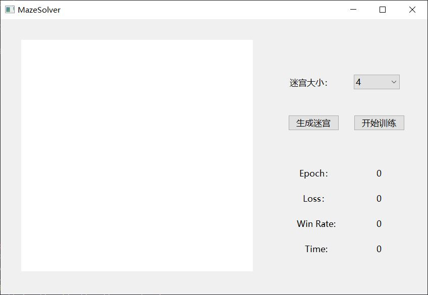
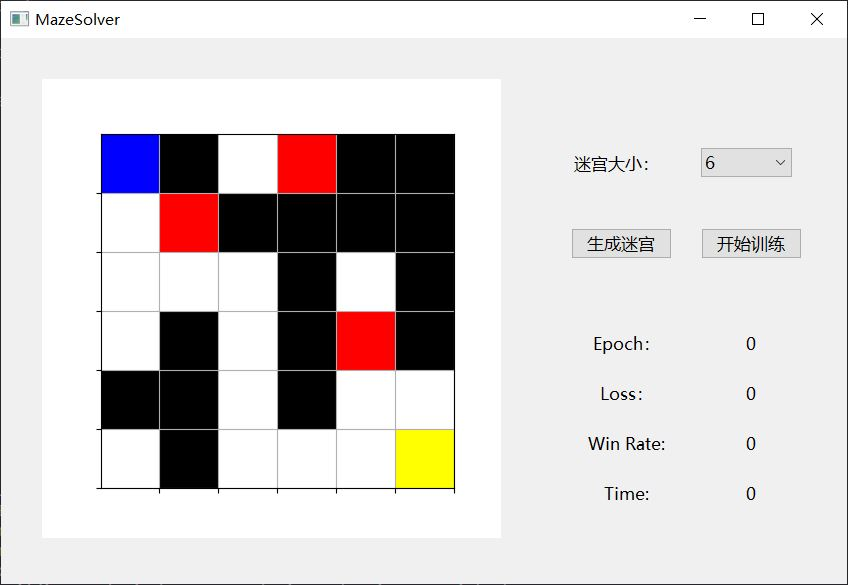
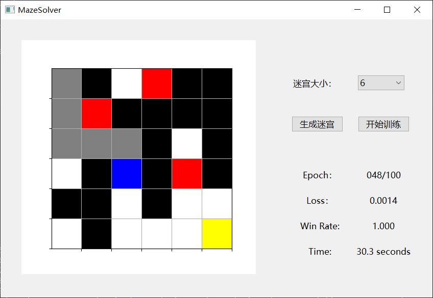
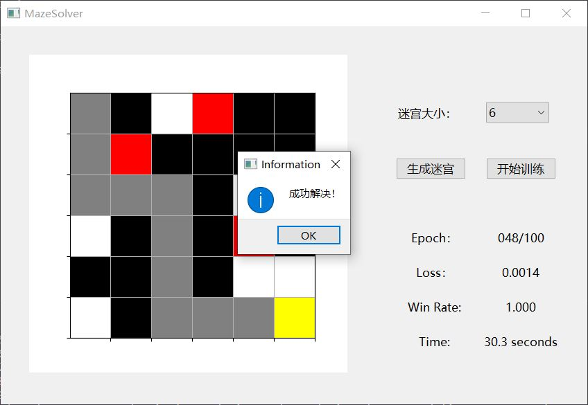

# MazeSolver

## 界面设计

下面是UI界面：

选择迷宫大小后，点击生成迷宫按钮，左边会出现随机生成并一定有解的迷宫。

其中蓝色方格代表老鼠，黄色方格代表奶酪，红色方格代表老鼠夹，黑色方格代表墙壁，灰色方格代表已走过的路径，白色方格代表未走过的路径。

点击开始训练按钮，会开始神经网络的训练。

耐心等待一段时间（6\*6的方格一般是1~2分钟之内，7\*7或8\*8会更久一些）之后，训练完成，右下方会显示训练过程中的一些参数。

接着左边的地图会动态地显示解迷宫的过程，如下图所示：

最后成功解决（极小可能会解决失败）：

之后用户可以重新生成迷宫，再次开始训练。

## 算法设计

本次作业只完成了所有的必做，未完成选做。

本次大作业的理论基础为马尔科夫决策过程。

### 环境

即上图中的迷宫，由老鼠，奶酪，墙壁，空地，老鼠夹组成。

老鼠从左上角出发，抵达右下角的奶酪时，游戏结束，视为成功。若游荡太久或踩到老鼠夹，游戏结束，视为失败。

随机生成迷宫后，会使用广度优先算法，检查能否从出发点到达结束点，如果不能则重新生成，以保证该迷宫是有解的。

### 智能体

即老鼠。

### 状态

即老鼠和迷宫组成的矩阵。

### 动作

共有上、下、左、右四个动作。

### 回报

初始回报为0，尝试撞墙或者出界会得到-0.75的回报，移动到走过的路径会得到-0.3的回报（这是避免老鼠在迷宫中无意义地游荡），移动到奶酪处会得到+1的回报，除此之外的正常移动会得到-0.05的回报。

总回报有一个最小的限制min_reward，这里设置为-0.05*迷宫的格子数，当总回报小于该数值时，游戏结束，视为失败。

可见，总回报的可能范围为[min_reward,1)，因此这里设置当老鼠踩到老鼠夹时，会得到min_reward - 1的回报，意味着游戏直接结束。

### 策略

这里使用的是时序差分中的Q-Learning算法。

我们认为，对于最佳策略$\pi_*(a|s)$是无法直接得出的，但这里我们通过神经网络拟合最佳行动价值函数$q_{\pi_*}(s,a)$，再利用
$$
\pi_{*}(a | s)=\left\{\begin{array}{ll}
{1} & {\text { if } a=\arg \max q_{*}(s, a)} \\
{0} & {\text { otherwise }}
\end{array}\right.
$$
间接得到$\pi_*(a|s)$。

### 训练网络

网络比较简单，两层全连接。

输入为伸展为一维向量后的状态，输出为在该状态下采取各个动作后的回报。

训练过程中，每个epoch会随机将老鼠放置在空地上，采用$\epsilon -$贪心算法确定下一步的动作，然后将这一个episode保存下来。

之后会随机从最近的episodes中取出一定数量的episode，获得输入数据和输出数据，并利用公式：
$$
Q\left(S_{t}, A_{t}\right) \leftarrow Q\left(S_{t}, A_{t}\right)+\alpha\left(R_{t+1}+\gamma \max _{a \in A} Q\left(S_{t+1}, a\right)-Q\left(S_{t}, A_{t}\right)\right)
$$
更新输出的数据，送进神经网络中进行回归训练。

当网络准确率高到一定程度时，结束训练，展示训练结果。

## 收获与体会

通过本次大作业，对马尔科夫决策过程和强化学习的概念有了更深刻的理解。

本次作业借鉴了参考资料中的思路和部分代码，但也做了很多优化，并且添加了可视化、随机生成迷宫等功能。

## 参考资料

<https://zhuanlan.zhihu.com/p/39617577>

<https://zhuanlan.zhihu.com/p/39630067>